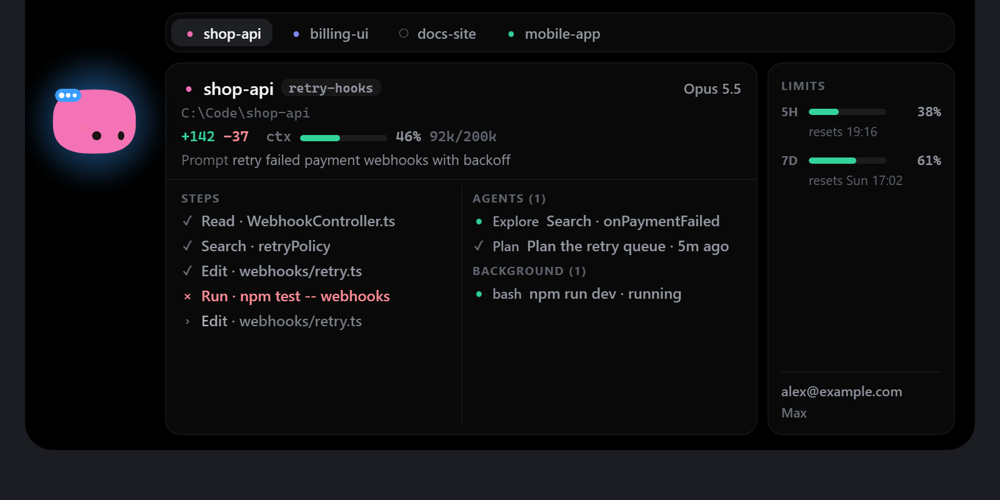
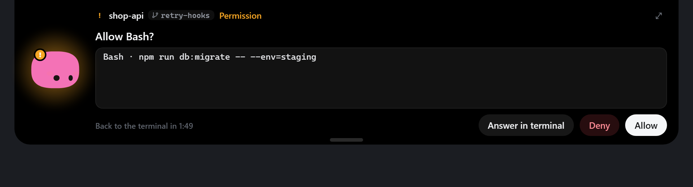
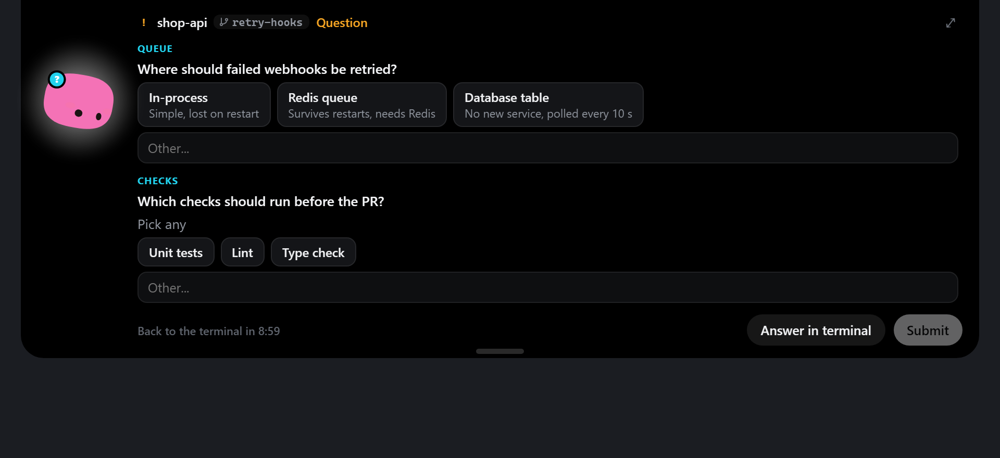
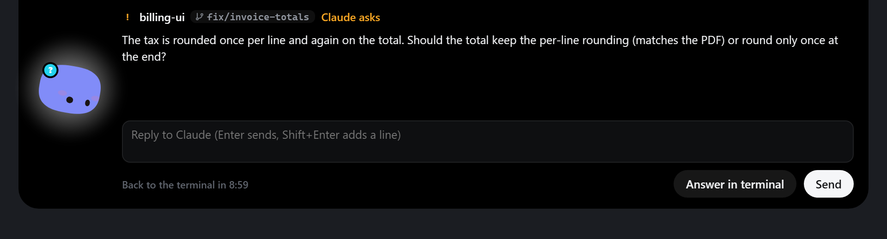
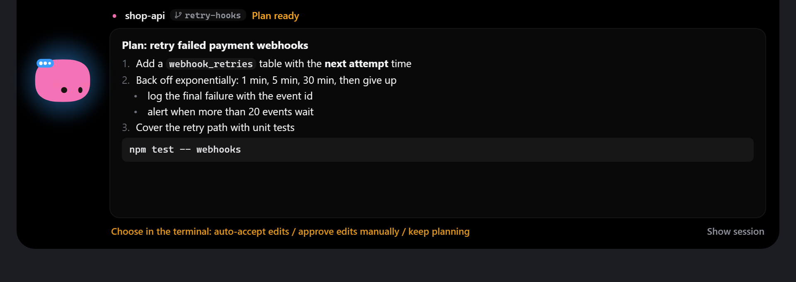
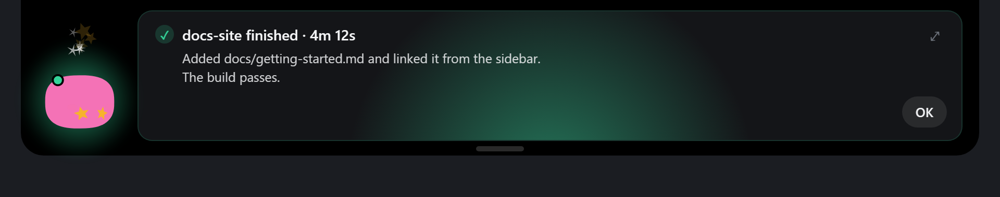
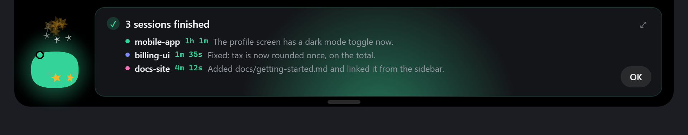

# Session Buddy

**All your Claude Code sessions in one small island at the top of the screen, and a way to answer them without hunting for the right terminal tab.**

  



## Why

When you run several Claude Code sessions in a terminal at once, one of them is always waiting for you: a permission prompt, a question, a "shall I go on?". You only notice when you happen to click on that tab. Session Buddy sits at the top edge of your screen, shows what every session is doing, and pops open the moment one needs you. You answer right there, or send it back to the terminal.

## Features

- **Every session at a glance**: project, branch, status, lines changed, context use, model and the current step.
- **Sub-agents and background tasks** of each session, live.
- **What a step did**: click an Edit or Write step for its diff, a command for its full text and the end of its output.
- **Answer from the island**: Allow / Deny permission requests, pick `AskUserQuestion` options, reply to a turn that ends in a question.
- **Plans** from plan mode, shown read-only while Claude Code waits in its own terminal dialog.
- **Finished sessions** show a short card with how long the turn took and how Claude's last message starts.
- **5-hour and 7-day limits** with reset times, per-model weekly limits (for example "7D Fable"), extra usage and the logged-in account.
- **Never in the way**: Claude Code is never blocked, even when the app is closed.
- **Chat** (off by default): ask Buddy a quick question, attach one of your sessions as context, or let it search the web. A background Claude Code (Haiku by default) runs only while you use it. Pick Sonnet, Opus or a model from your local Ollama in the chat header.
- **Pin** the expanded island to keep it open, or minimize it with one click.
- **Buddy**, the little character that shows each session's mood, plus soft sounds (can be turned off).

## Gallery

| | |
|---|---|
|  | **Strip.** Always on screen: how many sessions, who is working, who needs you, your limits. |
|  | **Compact.** Hover the strip: one session with branch, lines and current step. Scroll to flip sessions. |
|  | **Expanded.** Click: tabs for the running sessions (recent ones behind a pill), steps, sub-agents, background tasks, limits and account. |
|  | **Permission.** Allow or Deny a tool call, or hand it back to the terminal. |
|  | **Question.** `AskUserQuestion` options, multi-select and a free "Other..." answer. |
|  | **Reply.** Claude ended its turn with a question: type the answer right here. |
|  | **Plan.** The plan from plan mode, to read while you choose in the terminal. |
|  | **Finished.** A session is done: which one, how long it took, what it said. |
|  | **Several finished.** Sessions finishing close together share one card. |

## Download

Get the latest installer from **[GitHub Releases](https://github.com/wl-lankin/session-buddy/releases/latest)**:

- **Windows**: `Session Buddy_1.0.5_x64-setup.exe`. Installs for the current user, no admin needed.
- **macOS**: `Session Buddy_1.0.5_universal.dmg` (Apple silicon and Intel). Drag the app to Applications.

The builds are not code-signed yet, so the first start needs one extra click:

- **Windows SmartScreen**: "Windows protected your PC" > **More info** > **Run anyway**.
- **macOS Gatekeeper**: open the app once and click **Done**, then System Settings > Privacy & Security > **Open Anyway** (macOS 15 and later no longer offer right-click > Open). Or in a terminal: `xattr -dr com.apple.quarantine "/Applications/Session Buddy.app"`.

**Upgrading on Windows from an older "session-buddy" build?** Uninstall the old app first (Settings > Apps), because the install folder name changed. Your hooks and settings stay where they are.

### Build from source

You need [Rust](https://rustup.rs), Node 20+, and the MSVC build tools (Windows) or the Xcode Command Line Tools (macOS, `xcode-select --install`).

```bash
npm install
npm run pack
```

- Windows: run `target/release/bundle/nsis/Session Buddy_1.0.5_x64-setup.exe`.
- macOS: copy `target/release/bundle/macos/Session Buddy.app` to `/Applications` and open it.

On a MacBook with a notch the island wraps around it: the strip sits in the menu bar beside the notch, and the island grows down out of it. On other Macs it hangs centred just below the menu bar, on Windows from the top edge of the screen.

## Setup

1. Open the tray icon (Windows) or menu bar icon (macOS) > **Settings...**
2. Click **Install...**, review the diff, then click **Write**.
3. Start a new Claude Code session (running sessions pick it up after a restart).

What **Install** changes in `~/.claude/settings.json`:

- adds Session Buddy's hooks (each entry runs `sb-relay`),
- wraps your status line, so your own status line still runs and Session Buddy also gets the limits.

Before every write, a dated backup of `settings.json` is saved next to it, and only entries that contain `sb-relay` are ever added or removed. **Uninstall...** in the same place removes exactly those entries and restores your original status line.

On macOS the first limits refresh asks whether Session Buddy may read the "Claude Code-credentials" Keychain item. Choose **Always Allow**.

## Using it

- **Hover** the strip to see the compact card, **click** to expand.
- **Scroll** (mouse wheel) over the island to flip between sessions, or click a tab.
- **Hotkey** `Ctrl+Alt+Space` (change it in Settings) opens the island from anywhere and gives it the keyboard:
  left / right or Tab to switch sessions, 1-9 to jump, Enter to submit, Esc to close.
- When something waits for you, the island opens by itself and stays open until it is answered.
- **Answer in terminal** hands a request back to Claude Code's own prompt.

## How it works

Claude Code runs a tiny relay, `sb-relay`, for every hook event and as the status line. The relay forwards the event to the app over a per-user named pipe (Windows) or Unix socket (macOS).

- **It never blocks Claude Code.** If the app is not running, the relay gives up within 100 ms and prints nothing.
- Only permission requests, `AskUserQuestion` and a turn that ends in a question wait for your answer (up to 110 s and 9 min). "Answer in terminal", the deadline or a closed connection all fall back to the terminal.
- **Limits** 5H and 7D come from the status-line data when Claude Code provides them, otherwise from Claude Code's own usage endpoint. The per-model weekly limits and extra usage only exist there, so the endpoint is read every 10 minutes either way.

## Privacy

- No telemetry, no analytics, no accounts.
- Without the chat, the only network call is the usage endpoint (`GET https://api.anthropic.com/api/oauth/usage`), with Claude Code's own login token.
- That token is read fresh each time and never stored or logged.
- Diffs and the end of command output (at most 1500 characters per stream) only go from the relay to the app and are kept in memory, never written to disk.
- The chat is off until you turn it on. Then it starts the `claude` CLI in the background with your own Claude Code login: your messages go to Anthropic like any Claude Code use, and count against your plan. With a local Ollama model nothing leaves your machine, and there is no web search. The chat can only use web search and web fetch, no file or shell tools, and nothing it says is written to disk.
- Everything else stays on your machine.

## Troubleshooting

- **Logs**: `%LOCALAPPDATA%\session-buddy\session-buddy.log` (Windows), `~/Library/Logs/session-buddy.log` (macOS).
- **No sessions show up**: check Settings > Claude Code says "Hooks: installed", then start a *new* Claude Code session.
- **"Relay: missing"** in Settings: restart Session Buddy; it puts the relay in place on start-up. Then click Reinstall....
- **Limits stay empty**: the status line must be wrapped (Settings shows "Status line: wrapped"). Without it Session Buddy falls back to the usage endpoint, which needs you to be logged in to Claude Code.
- **Island on the wrong screen**: Settings > Island > Screen.

## Development

```bash
npm run dev               # the island in a browser; /dev/preview.html drives it with fake sessions
npm run screenshots       # renders docs/media/*.png from dev/shots.html with made-up data
npx vitest run            # front-end tests
cargo test --workspace    # relay, core, paths
npm run tauri dev         # the real app
```

Releases: push a tag like `v1.0.0` (or `v1.0.0-beta.1` for a prerelease); the Release workflow builds both installers into a draft release.

## Credits

Based on [Coucou](https://github.com/Louis-CFM/coucou) by Louis Raille (MIT). Buddy is based on Mochi from Coucou, and the animations and the 28 sounds come from there too. See [LICENSE-ASSETS.md](LICENSE-ASSETS.md).

## License

MIT, see [LICENSE](LICENSE).

---

<p align="center">Made with ♥ by <a href="https://wolfgang-linz.de">Wolfgang Linz</a></p>
<p align="center"><sub>Based on <a href="https://github.com/Louis-CFM/coucou">Coucou</a> by Louis Raille (MIT)</sub></p>
